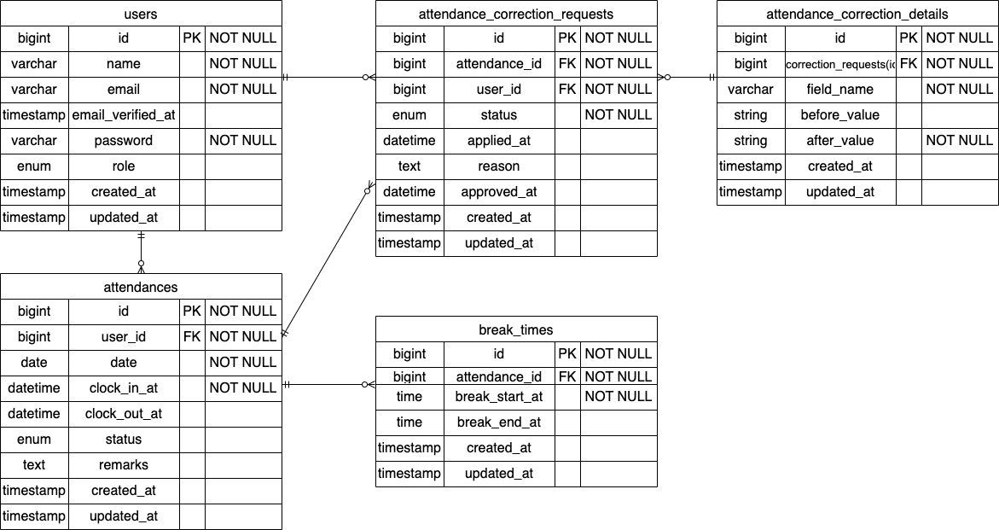

# Attendance-Management
# 環境構築
## Dockerビルド
1. git clone git@github.com:uedarina24-hue/Attendance-Management.git
2. cd Attendance-Management
3. DockerDesktopアプリを立ち上げる
4. docker-compose up -d --build

## Laravel環境構築
1. docker-compose exec php bash
2. composer install
3. 「.env.example」ファイルを 「.env」ファイルに命名を変更。または、新しく.envファイルを作成
4. .envに以下の環境変数を追加
    * DB_CONNECTION=mysql
    * DB_HOST=mysql
    * DB_PORT=3306
    * DB_DATABASE=laravel_db
    * DB_USERNAME=laravel_user
    * DB_PASSWORD=laravel_pass
5. アプリケーションキーの作成
    * php artisan key:generate
6. マイグレーション & シーディングの実行
    * php artisan migrate:fresh --seed
    * ダミーデータは migrate:fresh --seed を前提としています
    * db:seed を複数回実行すると勤怠データが重複します
7. fortifyの導入
    * Fortifyは本アプリでは導入済みです
8. 管理者権限制御
    * 管理者専用ミドルウェア（CheckAdmin）を使用しています
9. PHPunitを用いたテスト確認実行
    * docker-compose exec mysql bash
    * mysql -u root -p
    * CREATE DATABASE laravel_test;
    * SHOW DATABASES;
    * cp .env .env.testingに下記作成
       1. APP_ENV=testing
       2. APP_KEY=
       3. DB_CONNECTION=mysql
       4. DB_HOST=mysql
       5. DB_PORT=3306
       6. DB_DATABASE=laravel_test
       7. DB_USERNAME=root
       8. DB_PASSWORD=root
    * php artisan key:generate --env=testing
    * php artisan config:clear
    * php artisan migrate --env=testing
    * 下記各テスト確認を実行する
       1. vendor/bin/phpunit tests/Feature/Auth/RegisterTest.php
       2. vendor/bin/phpunit tests/Feature/Auth/UserLoginTest.php
       3. vendor/bin/phpunit tests/Feature/Auth/AdminLoginTest.php
       4. vendor/bin/phpunit tests/Feature/Attendance/AttendanceIndexTest.php
       5. vendor/bin/phpunit tests/Feature/Attendance/AttendanceListTest.php
       6. vendor/bin/phpunit tests/Feature/Attendance/AttendanceDetailTest.php
       7. vendor/bin/phpunit tests/Feature/Attendance/AttendanceRequestListTest.php
       8. vendor/bin/phpunit tests/Feature/Admin/AttendanceListTest.php
       11. vendor/bin/phpunit tests/Feature/Admin/AttendanceCorrectionTest.php
       12. vendor/bin/phpunit tests/Feature/Auth/EmailVerificationTest.php

## 使用技術(実行環境)
* PHP8.3.0
* Laravel8.83.27
* MySQL8.0.26

## 開発環境
* ユーザー登録：http://localhost/register
* ユーザーログイン画面：http://localhost/login
* 管理者ログイン画面：http://localhost/admin/login
* phpMyAdmin：http://localhost:8080/

## ログイン情報
### 管理者ユーザー
* メールアドレス：admin@example.com
* パスワード：password
### 一般ユーザー（認証済み）
* メールアドレス：任意の一般ユーザー
* パスワード：password
### 一般ユーザー（未認証）
* メールアドレス：yamada.tarou@example.com
* パスワード：password
  * 初回ログイン時に手動送信によるメール認証が必要です
  * 認証メールは MailHog（http://localhost:8025/）で確認できます

## ダミーデータ作成
* ユーザー情報
  * 管理者ユーザーと一般ユーザー(認証済み５名、未認証１名)を作成
* 勤怠記録情報
  * 出勤・退勤・休憩時間に関するダミーデータを作成可能

## ER図
# Attendance-Management
